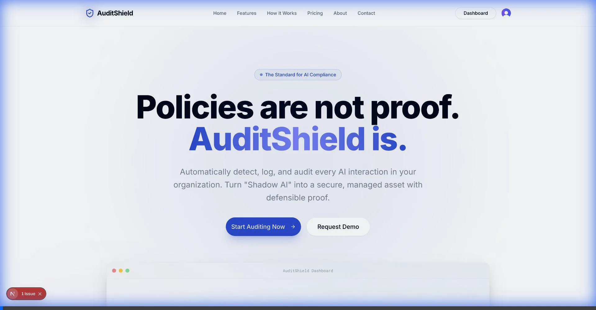

# AuditShield 🛡️

**Tamper-Evident AI Compliance & Data Leak Prevention**

AuditShield is a premium, Series-B Security SaaS platform designed to monitor, audit, and secure AI interactions across your organization. It provides a "Head-Up Display" for AI tools like ChatGPT, Claude, and Gemini, ensuring that sensitive data never leaves your environment and that every interaction is logged for compliance.



## ✨ Core Features

### 1. **Invisible Security (Chrome Extension)**
- **Real-time Monitoring**: Automatically detects and audits every interaction with AI platforms (ChatGPT, Claude, Gemini, Perplexity).
- **Data Leak Prevention (DLP)**: Scans inputs for sensitive information (PII, API keys, credentials) before they are sent to AI tools.
- **Head-Up Display**: A sleek header inside AI tools that shows real-time protection status and session stats.
- **Micro-interactions**: High-performance UI built with Framer Motion for a premium, native feel.

### 2. **Compliance Dashboard (Web)**
- **Pulse Monitoring**: Real-time activity feed showing AI interactions across the entire organization.
- **Live Stats**: Interactive cards visualizing total AI usage, active policies, and risk violations.
- **Tamper-Evident Logs**: Cryptographically-linked audit logs ready for SOC 2 or HIPAA audits.
- **Policy Management**: Configure granular rules (Allow, Block, Review) for specific AI domains.

### 3. **High-Performance Architecture**
- **Low-Latency Caching**: Integrated Upstash Redis caching for near-instant policy lookups and dashboard updates.
- **Serverless Backend**: Built on Next.js 14 and Neon Postgres for high scalability and zero-maintenance infrastructure.
- **Robust Auth**: Secured with Clerk for enterprise-grade user management and identity tracking.

## 🛠️ Tech Stack

- **Dashboard**: Next.js 14 (App Router), TypeScript, Tailwind CSS, Framer Motion, shadcn/ui.
- **Extension**: React, Vite, CRXJS, Chrome Manifest V3.
- **Database**: Neon (Serverless PostgreSQL) with Drizzle ORM.
- **Caching**: Upstash Redis (REST-based caching layer).
- **Authentication**: Clerk (Enterprise-ready auth).
- **Infrastructure**: Vercel.

## 🚀 Getting Started

### Prerequisites
- Node.js 18+
- [Neon](https://neon.tech/) Database URL
- [Clerk](https://clerk.dev/) API Keys
- [Upstash](https://upstash.com/) Redis URL & Token

### Installation

1. **Clone the repository:**
   ```bash
   git clone https://github.com/callmeumair/AuditShield.git
   cd AuditShield
   ```

2. **Setup the Dashboard:**
   ```bash
   cd apps/web
   cp .env.example .env.local
   # Fill in NEON_DATABASE_URL, CLERK_SECRET_KEY, and UPSTASH_REDIS variables
   npm install
   npm run dev
   ```

3. **Setup the Extension:**
   ```bash
   cd apps/extension
   npm install
   npm run build
   ```
   - Open Chrome and navigate to `chrome://extensions`.
   - Enable **Developer Mode**.
   - Click **Load unpacked** and select the `apps/extension/dist` folder.

## 🛡️ Security & Compliance
AuditShield is built with a "Security-First" approach, inspired by modern security SaaS aesthetics (Series-B style). It emphasizes transparency, trust, and performance.

- **SOC 2 Ready**: Audit logs are formatted for easy export to auditors.
- **GDPR Compliant**: Local scanning means sensitive data stays in your browser until it's compliant.

## 📄 License
This project is licensed under the MIT License - see the LICENSE file for details.

---
*Built with ❤️ for secure AI adoption.*
